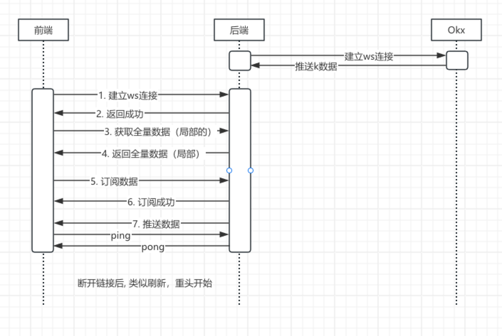

= {toc-title} - {version-label}
:author: JouZiton
:doctype: 类型
:encoding: utf-8
:lang: 中文
:numbered: 编号
:stem: latexmath
:icons: font
:source-highlighter: coderay
:sectnums:
:sectlinks:
:sectnumlevels: 2
:toc: left
:toc-title: 接口文档
:version-label: V0.0.1
:toclevels: 3
:docdate: 2024-7

[preface]
== 前言

== Rest API 接口

[NOTE]
====
`Rest API 接口` 应该通过 `swagger` 定义接口文档, 然后链接过去.
====

=== 登录接口

=== 用户信息接口

=== 交易接口

=== 订单接口

== WS API 接口

=== ws连接规范:

==== 心跳处理

. 心跳由前端发起, 发送``ping``, 后端收到信息之后回复``pong``
. 心跳频率: 10s/次

==== 请求参数规范

[source, json]
----
{
  "opCode": 0,
  "st": "now",
  "args": [
      {
          "a": "a",
          "b": "b"
      }
  ]
}
----

==== 响应参数规范

[source, json]
----
{
  "code": 0,
  "st": 1,
  "et": 2,
  "data": [
      {
          "a": "a",
          "b": "b"
      }
  ]
}
----

=== K线数据接口(实时)

==== 流程说明

.首先, 后端与Okx服务建立连接, 获取实时的K线数据
. 前端与后端建立websocket连接, 实时接收K线数据
. 后端返回建立的websocket连接成功信息
. 前端接收到websocket连接成功信息, 开始请求（局部）全量数据
. 后端返回（局部）全量数据
. 前端接收到（局部）全量数据, 并开始准备订阅数据
. 后端返回订阅成功信息
. 后端开始推送订阅数据

*_注意:_* 前后端之间建立的websocket连接, 需要保持长连接, 并通过心跳包(`ping/pong`)维持连接状态.

[NOTE]
====
【待解决】重新建立连接的流程还没想明白.
====

==== 接口说明

===== 第一步: 建立websocket连接

建立websocket连接URL: `ws://ip:port/ws/v1/iplulic`

收到建立连接成功后, 直接进行第二步

===== 第二步: 订阅数据

.请求参数:
[%collapsible]
====

|===
| 参数名 |类型 | 是否必须 |描述

| opCode | int | 是 | code编码. 订阅数据 `1003`
| msg | string | 否 | 请求订阅数据.
| startTime | long | 否 | 当前请求时间, 单位: 毫秒.
| uid | string | 是 | 客户端唯一标识, 例如 mac地址
| args | array | 是 | 具体的请求参数
| > instId | string | 是 | 交易对名称, 例如: BTC-USDT-SWAP
| > bar | string | 是 | 周期
| > channel | string | 否 | 通道名称, 例如: `tickers`、`kline`. 详细说明见``附录1.3``
| > limit | int | 否 | 推送数据限制条数. 默认 `1000`
| > interval | int | 否 | 推送时间最小时间间隔, 单位 毫秒. 默认 `1000ms`

|===

.channel=tickers
|===
| 参数名 |类型 | 是否必须 |描述
| trend | string | 是 | 指定趋势类型
|===

.channel=kline
|===
| 参数名 |类型 | 是否必须 |描述
| instId | string | 是 | 产品ID
| instType | array | 否 | 产品类型
| bar | string | 是 | 时间周期
|===

.请求数据样例
[source, json]
----
{
    "opCode": 1003,
    "msg": "subscribe 请求订阅数据",
    "uid": "ACD-ASX-123S-AXS",
    "args": [
        {
            "channel": "tickers",
            "trend": "up/down",
            "limit": 200,
            "interval": 1000
        },
        {
            "channel": "kline",
            "instId": "ETH-USDT",
            "instType": ["SWAP","SPOT"],
            "bar": "1m",
            "limit": 1000,
            "interval": 1000
        }
    ]
}
----
====

.响应参数:
[%collapsible]
====
[cols="^,^,^"]
|===
| 参数名 | 类型 | 描述
| code | int | 0表示请求成功, 其他表示请求失败
| msg | string | 请求失败的原因
| data | array | 请求成功的K线数据
| > instId | string | 交易对名称, 例如 BTC-USDT
| > channel | string | 通道名称, 例如: `tickers`、`kline`. 详细说明见``附录1.3``
| > data | array | K线数据列表. 详情见``附录1.1``
| > bar | string | K线类型, 例如 M_15
|===

.响应数据样例
[source,json]
----
{
  "code": 0,
  "data": [
    {
      "channel": "tickers",
      "trend": "up/down",
      "data":[
        {
          "instId": "BTC-USDT",
          "instType": "MARGIN",
          "markPx": "67145.0",
          "ts": "1730010747815"
        }
      ]
    },
    {
      "channel": "kline",
      "instId": "BTC-USDT",
      "bar": "M_15",
      "data": [
        ["2024-12-2 12:00:00", 12345.67, 12345.67, 12345.67, 12345.67, 1234567, 123456789.01, 0.01, 0.02, 0.03, 0.04],
        ["2024-12-2 12:00:00", "12345.67", "12345.67", "12345.67", "12345.67", 1234567, 123456789.01, 0.01, 0.02, 0.03, 0.04]
      ]
    }
  ]
}
----
====

=== K线数据接口(模拟任务)

==== 流程说明

==== 接口说明

===== 第一步: 建立websocket连接

建立websocket连接URL: `ws://ip:port/emulatorTask`

收到建立连接成功后, 直接进行下一步

===== 第二步: 订阅数据

.请求参数:
[%collapsible]
====
|===
| 参数名 |类型 | 是否必须 |描述
| opCode | int | 是 | 开始订阅数据操作码: `1003`
| msg | string | 否 | 描述信息【可选】
| data | object | 是 | 具体的请求参数
| > uid | string | 是 | 客户端唯一标识, 例如 mac地址
| > instId | string | 是 | 交易对名称, 例如 BTC-USDT
| > bar | string | 否 | 时间周期. 取值有: `15m`, `30m`, `1h`, `1d`. 默认值为`1d`
| > limit | int | 否 | 限制数量, 默认为1000
| > autoPush | boolean | 否 | 是否自动推送，默认true
| > interval | int | 否 | 推送时间间隔, 单位: 毫秒. 默认为1000. 这个值只适用于``autoPush = true``的情况.
|===

.请求数据样例
[source,json]
----
{
    "opCode": 1003,
    "msg": "请求订阅数据",
    "uid": "ACD-ASX-123S-AXS",
    "data": {
      "uid": "ACD-ASX-123S-AXS",
      "instId": "BTC",
      "bar": "1h",
      "limit": 2000,
      "autoPush": true,
      "interval": 1000
    }
}
----
====

.响应参数:
[%collapsible]
====
|===
| 参数名 | 类型 | 描述
| code | int | 0表示成功, 其他表示连接失败
| opCode | int | 2003 表示订阅成功
| msg | int | 描述信息, 可能返回, 可能不返回
|===

.响应数据样例
[source,json]
----
{
  "code": 0,
  "opCode": 2003,
  "msg": "【响应】ws k线数据订阅成功"
}
----
====

===== 第三步: 推送数据

如果``autoPush``为``false``, 则需要前端主动请求数据.

.请求参数:
[%collapsible]
====
|===
| 参数名 |类型 | 是否必须 |描述
| opCode | int | 是 | 请求推送数据操作码: `1004`
| msg | string | 否 | 描述信息, `请求推送数据`
|===

.请求数据样例
[source,json]
----
{
    "opCode": 1004,
    "msg": "请求推送数据"
}
----
====

.推送数据
[%collapsible]
====
|===
| 参数名 | 类型 | 描述
| code | int | 0表示请求成功, 其他表示请求失败
| msg | string | 描述信息【可选】
| opCode | int | `3004` 表示推送数据
| data | object | 请求成功的K线数据
| > instId | string | 交易对名称, 例如 BTC-USDT
| > bar | string | K线类型, 例如 M_15
| > dataList | array | K线数据列表
| >> data | array | K线数据列表【数据格式参考``附页 A``】
| >> orders | array | 订单列表【数据格式参考``附页 B``】
|===

.响应数据样例
[source,json]
----
{
  "code": 0,
  "opCode": 3004,
  "msg": "推送的数据",
  "data": {
    "instId": "BTC",
    "bar": "M_15",
    "dataList": [
     {
         "data":  ["2024-12-2 12:00:00", 12345.67, 12345.67, 12345.67, 12345.67, 1234567, 123456789.01, 0.01, 0.02, 0.03, 0.04],
         "orders": null
     },
     {
         "data":  ["2024-12-2 13:00:00", 12345.67, 12345.67, 12345.67, 12345.67, 1234567, 123456789.01, 0.01, 0.02, 0.03, 0.04],
         "orders": [{},{}]
     }
     ]

  }
}
----
====

==== 错误码说明 ---- TODO

== 状态码字典 --- TODO

== 错误码字典 --- TODO

[appendix]
== 附录 1
=== K 线数据说明

.K线数据格式:
[cols="^,^,^"]
|===
| 序号 | 类型 | 描述
| 0 | `ts` | 开盘时间
| 1 | `float` | 开盘价
| 2 | `float` | 收盘价
| 3 | `float` | 最低价
| 4 | `float` | 最高价
| 5 | `float` | 成交量
| 6 | `float` | 成交额
| 7 | `float` | macd值
| 8 | `float` | dif值
| 9 | `float` | dea值
| 10 | `float` | RSI值
|===

.K线数据样例
[%collapsible]
====
[source, json]
----
[
    "2024-12-2 13:00:00",
    12345.67,
    12345.67,
    12345.67,
    12345.67,
    1234567,
    123456789.01,
    0.01,
    0.02,
    0.03,
    0.04
]
----
====

=== 订单列表

.订单列表数据格式:
[cols="^,^,^"]
|===
| 字段 | 类型 | 描述
| `cTime` | 时间戳[秒级] | 开盘时间
| `ordId` | `string` | 订单ID
| `ordPx` | `float` | 操作价格
| `sz` | `float` | 委托数量
| `side`| `string` | 买卖方向. ``buy``表示买入, ``sell``表示卖出.
|===

.订单列表数据样例
[%collapsible]
====
[source, json]
----
{
  "instId": "BTC-USDT-SWAP",
  "ordId": "d41918e6-e3c5-4953-be20-d7788257aa04",
  "clOrdId": "d41918e6-e3c5-4953-be20-d7788257aa04",
  "sz": 0.0023470982,
  "ordType": "market",
  "side": "buy",
  "posSide": "long",
  "tdMode": "cross",
  "lever": 1,
  "ordPx": 42605.8,
  "cTime": 1705111200
}
----
====

=== 通道编码说明

.通道编码说明:
[cols="^,^"]
|===
| 字段  | 描述
| `kline` | K线数据
| `tikers` | 实时数据推送
|===

